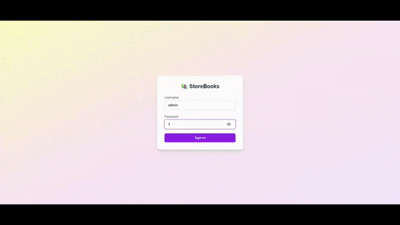
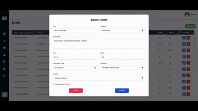

# 📚 StoreBooks — Sistema de Gestión de Librería

**StoreBooks** es un sistema backend completo para administrar el catálogo, ventas, clientes y usuarios en una librería. Permite gestionar libros, autores, editoriales, facturación y generación de reportes de ventas.

---

## 🚀 Tecnologías Usadas

- **Backend**: Spring Boot (Java 17+)
- **Base de Datos**: PostgreSQL
- **Librerías**: JPA, Hibernate
- **Arquitectura**: RESTful APIs

---

## ⚙️ Requisitos

- **Java 17** o superior
- **Maven** instalado
- **PostgreSQL** en ejecución

### 📦 Base de datos inicial

1. Descarga y ejecuta el script SQL:  
   `src/main/resources/helper/storebooks-database-download.sql`
2. Asegúrate de tener la base de datos creada y accesible antes de iniciar la app.

### 🔐 Usuario admin (web)

- **Usuario:** `admin`
- **Contraseña:** `admin1234`
> Credencial para acceder como administrador en la página web.

## 📌 Entidades

### 📚 Editorial
| Campo       | Tipo       | Descripción               |
|-------------|------------|---------------------------|
| id (PK)   | Long     | ID único                  |
| nombre    | String   | Nombre de la editorial    |
| teléfono  | String   | Teléfono de contacto      |
| sitio_web | String   | URL del sitio web         |
| email     | String   | Email de contacto         |
| estado    | Boolean  | Estado activo/inactivo    |

### 📖 Libro
| Campo               | Tipo         | Descripción                     |
|---------------------|--------------|---------------------------------|
| ISBN (PK)         | String     | Código único del libro          |
| título            | String     | Título del libro                |
| editorial_id      | Long       | FK a Editorial                  |
| fecha_publicacion | Date       | Fecha de publicación            |
| precio            | BigDecimal | Precio de venta                 |
| stock             | Integer    | Cantidad en inventario          |

### ✍️ Autor
| Campo          | Tipo       | Descripción                     |
|----------------|------------|---------------------------------|
| id (PK)      | Long     | ID único                        |
| nombre       | String   | Primer nombre                   |
| apellido     | String   | Apellido                        |
| email        | String   | Email de contacto               |
| estado       | Boolean  | Estado activo/inactivo          |

### 🔗 LibroAutor (Tabla intermedia)
| Campo       | Tipo   | Descripción                     |
|-------------|--------|---------------------------------|
| id (PK)   | Long | ID único                        |
| id_libro  | String | FK a Libro (ISBN)              |
| id_autor  | Long | FK a Autor                     |

### 🧾 Factura
| Campo           | Tipo         | Descripción                     |
|-----------------|--------------|---------------------------------|
| id (PK)       | Long       | ID único                        |
| id_cliente    | Long       | FK a Cliente                    |
| fecha_emision | Date       | Fecha de la factura             |
| subtotal      | BigDecimal | Subtotal antes de impuestos     |
| total         | BigDecimal | Total a pagar                   |

### 📝 DetalleFactura
| Campo        | Tipo         | Descripción                     |
|--------------|--------------|---------------------------------|
| id (PK)    | Long       | ID único                        |
| libro_id   | String     | FK a Libro (ISBN)               |
| id_factura | Long       | FK a Factura                    |
| cantidad   | Integer    | Cantidad comprada               |
| subtotal   | BigDecimal | Precio x cantidad               |

### 👤 Cliente

| Campo               | Tipo         | Descripción                              | Restricciones               |
|---------------------|--------------|------------------------------------------|-----------------------------|
| id (PK)           | Long       | ID único del cliente                     | Auto-increment              |
| nombre            | String     | Nombre completo                          | Not null, max 100 chars      |
| identificacion    | String     | DNI/Cédula/RUC                           | Not null, unique             |
| direccion         | String     | Dirección física                         | Max 200 chars               |
| telefono          | String     | Teléfono de contacto                     | Max 20 chars                |
| email             | String     | Correo electrónico                       | Not null, unique, email format |
| fecha_registro    | LocalDate  | Fecha de registro en el sistema          | Default current date        |
| estado            | Boolean    | Estado (Activo/Inactivo)                 | Default true                |
| tipo_cliente      | Enum       | Tipo (NORMAL/PREMIUM/CORPORATIVO)        | Default NORMAL              |
| limite_credito    | BigDecimal | Límite de crédito para compras           | Default 0.00                |

## 📘 Endpoints de la API

### 📗 Catálogo

#### 🔹 Autores
- `GET /storebooks/authors`: Listar todos los autores
- `GET /storebooks/authors/{id}`: Obtener autor por ID
- `POST /storebooks/authors`: Crear nuevo autor
- `PUT /storebooks/authors/{id}`: Actualizar autor
- `DELETE /storebooks/authors/{id}`: Eliminar autor

#### 🔹 Libros
- `GET /storebooks/books`: Listar todos los libros
- `GET /storebooks/books/{id}`: Obtener libro por ID
- `POST /storebooks/books`: Crear nuevo libro
- `PUT /storebooks/books/{id}`: Actualizar libro
- `DELETE /storebooks/books/{id}`: Eliminar libro

#### 🔹 Editoriales
- `GET /storebooks/editorials`: Listar todas las editoriales
- `GET /storebooks/editorials/{id}`: Obtener editorial por ID
- `POST /storebooks/editorials`: Crear nueva editorial
- `PUT /storebooks/editorials/{id}`: Actualizar editorial
- `DELETE /storebooks/editorials/{id}`: Eliminar editorial

---

### 💵 Ventas

#### 🔹 Facturación
- `GET /storebooks/invoices`: Listar todas las facturas
- `GET /storebooks/invoices/{id}`: Obtener factura por ID
- `POST /storebooks/invoices`: Crear nueva factura
- `DELETE /storebooks/invoices/{id}`: Eliminar factura

---

### 📊 Reportes

- `GET /storebooks/reports/best-sellers-by-category`: Libros más vendidos por categoría
- `GET /storebooks/reports/low-rotation-books`: Libros con baja rotación
- `GET /storebooks/reports/monthly-sales`: Ventas mensuales
- `GET /storebooks/reports/best-sellers`: Libros más vendidos

---

### 👤 Usuarios

#### 🔹 Administradores
- `POST /storebooks/administrators`: Crear administrador
- `GET /storebooks/administrators/login`: Login de administrador

#### 🔹 Clientes
- `POST /storebooks/customers`: Crear cliente
- `GET /storebooks/customers/{id}`: Obtener cliente por ID  

## 🌐 Frontend - StoreBooks

🛍️ Aplicación Angular integrada como frontend del sistema **StoreBooks**, servida directamente desde el backend Spring Boot como monorepo.

### ▶️ Ver frontend

---

### 📸 Vistas en acción

  

---